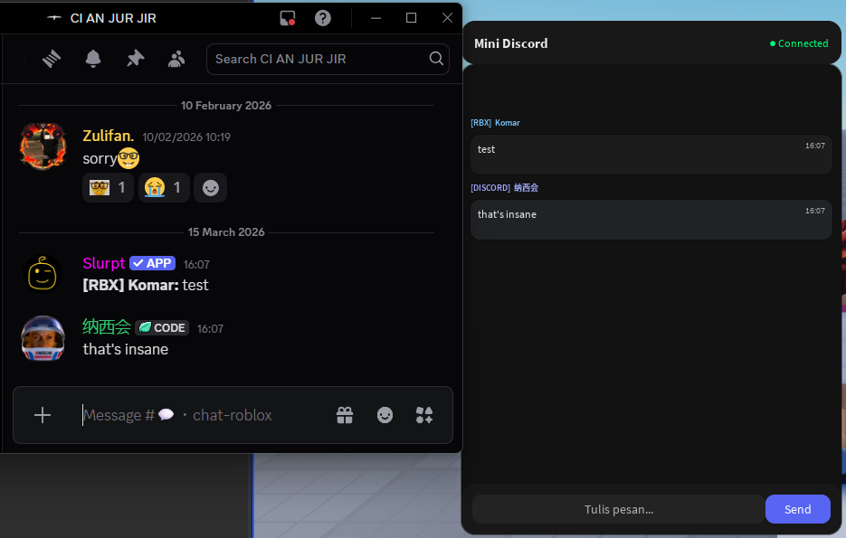

# Roblox Discord Bridge

Two-way bridge between a Roblox game and a Discord server. Players in Roblox can send messages to Discord and, conversely, Discord users can send messages into the Roblox game.

## 🎯 Features

- ✅ **Roblox → Discord**: Players in the Roblox game can send messages to a Discord channel
- ✅ **Discord → Roblox**: Messages from Discord appear in an in-game mini Discord-like UI
- ✅ **Real-time**: Polling-based message synchronization
- ✅ **Modern UI**: Discord-inspired interface inside Roblox

## 📸 Preview



## 📋 Prerequisites

1. **Node.js** (v16 or newer)
2. **Discord Bot Token** - Create a bot in the [Discord Developer Portal](https://discord.com/developers/applications)
3. **Roblox Studio** - To run the client script

## 🚀 Setup

### 1. Install Dependencies

```bash
npm install
```

### 2. Setup Discord Bot

1. Go to the [Discord Developer Portal](https://discord.com/developers/applications)
2. Create a new application (or pick an existing one)
3. Open the "Bot" tab and create a bot
4. Copy the **Bot Token**
5. Enable **Message Content Intent** in the "Bot" tab (important!)
6. Invite the bot to your server with these permissions:
   - Send Messages
   - Read Message History
   - View Channels

### 3. Environment Configuration

1. Copy `.env.example` to `.env`:
   ```bash
   copy .env.example .env
   ```

2. Edit `.env` and fill in:
   ```
   DISCORD_TOKEN=your_discord_bot_token_here
   CHANNEL_ID=your_discord_channel_id_here
   PORT=3000
   SHARED_SECRET=your_secure_secret_key_here
   ```

   **How to get `CHANNEL_ID`:**
   - Enable Developer Mode in Discord (Settings > Advanced > Developer Mode)
   - Right-click the channel you want to use
   - Select "Copy ID"

### 4. Run the Server

```bash
npm start
```

The server will run at `http://localhost:3000`

### 5. Setup Roblox Client

1. Open Roblox Studio
2. Open the game where you want to add the Discord Bridge
3. Open `roblox-client.lua` from this project
4. **Edit the configuration at the top of the script:**
   ```lua
   local API_URL = "http://localhost:3000"  -- Replace with your server URL/IP
   local SHARED_SECRET = "dev-secret"  -- Must match the server .env
   ```
5. Copy the entire contents of `roblox-client.lua`
6. In Roblox Studio, create a new **LocalScript** in:
   - `StarterPlayer > StarterPlayerScripts` (for LocalScript)
   - Or `ServerScriptService` (for ServerScript)
7. Paste the script into the LocalScript/ServerScript
8. **IMPORTANT**: Enable HTTP requests in Roblox Studio:
   - File > Game Settings > Security
   - Enable "Allow HTTP Requests"
   - Add your server domain to the whitelist

## 🌐 Deploy to Production

If you want to deploy the server so it can be accessed externally:

### Option 1: Local Network (LAN)
- Replace `API_URL` in the Roblox script with your local IP (e.g. `http://192.168.1.100:3000`)
- Make sure your firewall allows port 3000

### Option 2: Cloud Hosting
- Deploy to a platform such as:
  - **Railway** (railway.app)
  - **Render** (render.com)
  - **Heroku** (heroku.com)
  - **VPS** (DigitalOcean, AWS, etc.)
- Update `API_URL` in the Roblox script with your hosted URL
- Use HTTPS if possible

### Option 3: ngrok (Development/Testing)
```bash
ngrok http 3000
```
Copy the URL you get and use it as `API_URL` in the Roblox script.

## 📁 Project Structure

```
rbx-discord-bridge/
├── index.js              # Main server (Express + Discord.js)
├── roblox-client.lua     # Roblox Studio client script
├── package.json
├── .env                  # Configuration (do not commit!)
├── .env.example          # Configuration template
└── README.md
```

## 🔧 API Endpoints

### `POST /roblox/send`
Send a message from Roblox to Discord.

**Headers:**
```
x-shared-secret: your_secret_key
```

**Body:**
```json
{
  "name": "PlayerName",
  "text": "Message from Roblox"
}
```

### `GET /roblox/poll`
Get new messages from Discord (polling).

**Headers:**
```
x-shared-secret: your_secret_key
```

**Query:**
```
?since=123  // ID of the last message you received
```

**Response:**
```json
{
  "ok": true,
  "messages": [
    {
      "id": 1,
      "source": "discord",
      "name": "Username",
      "text": "Message from Discord",
      "ts": 1234567890
    }
  ],
  "nextSince": 1
}
```

## ⚠️ Troubleshooting

### Bot is not receiving messages
- Make sure **Message Content Intent** is enabled in the Discord Developer Portal
- Make sure the bot was invited to the server with the correct permissions
- Make sure `CHANNEL_ID` is correct

### Roblox can't connect to the server
- Make sure HTTP Requests are enabled in Roblox Studio
- Make sure `API_URL` is correct
- Make sure the server is running
- Check firewall/network settings

### Messages don't show up in Roblox
- Make sure `SHARED_SECRET` matches between server and client
- Check the server console for errors
- Make sure the polling interval isn't too fast (minimum 1 second)

## 🔒 Security Notes

- **DO NOT** commit the `.env` file to git
- Use a strong `SHARED_SECRET` in production
- Consider rate limiting to prevent spam
- Use HTTPS in production if possible

## 📝 License

ISC

## 🤝 Contributing

Feel free to submit issues or pull requests!
